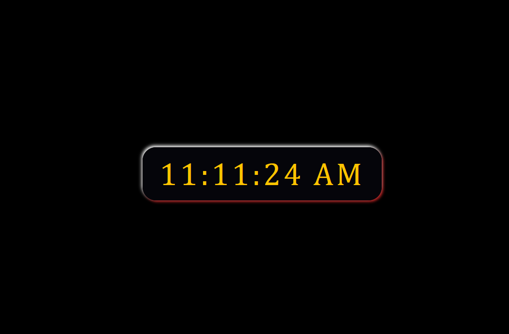

This is a digital clock using html,css and js

## Screenshot

##My process

i started to work this project from html first and css then to add some functionality like date for hour,minute and second
i can use js

## Built with

html css js

## Author

Abiy Teklu
